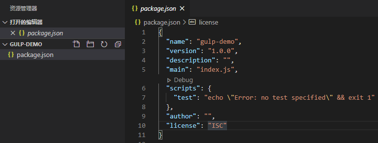

# gulp demo
这是我学习[gulp](https://www.gulpjs.com.cn/)的笔记，在此记录下来，供大家参考和指正

### 新建项目
这里我们新建一个文件夹gulp-demo，然后在项目目录下创建 package.json 文件
```shell
npm init
```
成功创建package.json



### gulp准备工作
安装 gulp，作为开发时依赖项
```shell
yarn add gulp
```

创建gulpfile.js


以上就完成了准备工作，下面我们先实现一个合并js的小demo

### 一、合并js

#### 原文件目录
在项目新建src/js/test1.js、src/js/test2.js两个js文件，并写随便写一点测试代码。

test1.js
```javascript 
(function () {
  function foo(num1, num2) {
    return num1 + num2;
  }
  console.log(foo(22, 56));
})()
```

test2.js
```javascript 
(function () {
  var result = [1, 2, 3, 4, 5].map((item) => {
    return item + 10;
  });
  console.log(result);
})()
```

### 输出文件目录
在项目新建dist/js文件夹，用来存储gulp输出的文件。


### gulp-concat插件安装
这里我们合并js是gulp-concat这个插件，我们可以前往[https://gulpjs.com/plugins/](https://gulpjs.com/plugins/)去寻找更多更合适的插件


#### 安装gulp-concat
```shell
yarn add gulp-concat
```
#### 配置gulpfile.js
```javascript
const concat = require('gulp-concat');
const { series, src, dest } = require('gulp');

// 注册合并压缩js的任务
function concatJs() {
  // return src('src/js/**/*.js')  // 深遍历
  return src('src/js/*.js')  // 浅遍历 找到目标原文件
    .pipe(concat('build.js')) // 临时合并文件
    .pipe(dest('dist/js/'));  // 输出目录
}

exports.default = series(concatJs); // 默认任务 执行命令：gulp
exports.concatJs = series(concatJs); // 单独任务 执行命令：gulp concatJs
```

#### 执行gulp命令
gulp执行任务的语法是 
```shell
gulp 任务名
```

我们这里的任务名是'concatJs'，所以直接gulp concatJs
```shell
gulp concatJs
```
执行完之后，就会发现dist/js多了一个build.js文件，其中build.js的代码就是test1.js和test2.js合并之后的代码。


成功使用gulp合并js。

#### 在合并的基础上再进行压缩(gulp-uglify)
因为test1.js、 test2.js是通过es6写的，[gulp-uglify](https://www.npmjs.com/package/gulp-uglify)不支持es6，所以可以先用[gulp-babel](https://www.npmjs.com/package/gulp-babel)将es6转为es5。

引入gulp-babel
```shell
cnpm i gulp-babel @babel/core@7 babel-preset-env --save-dev
```
引入gulp-uglify
```shell
yarn add gulp-babel
```
修改gulpfile.js
```javascript
const concat = require('gulp-concat');
const uglify = require('gulp-uglify');
const babel = require('gulp-babel');
const { series, src, dest } = require('gulp');

// 注册合并压缩js的任务
function concatJs() {
  // return src('src/js/**/*.js')  // 深遍历
  return src('src/js/*.js')  // 浅遍历 找到目标原文件
    .pipe(concat('build.js')) // 临时合并文件
    .pipe(babel({  // build.js es6转化为es5
      presets: ['env']
    }))
    .pipe(uglify()) // 压缩build.js
    .pipe(dest('dist/js/'));  // 输出目录
}

exports.default = series(concatJs); // 默认任务 执行命令：gulp
exports.concatJs = series(concatJs); // 单独任务 执行命令：gulp concatJs
```
配置完后在终端执行
```shell
gulp
```
或
```shell 
gulp concatJs
```
合并压缩test1.js和test2.js，得到build.js。

